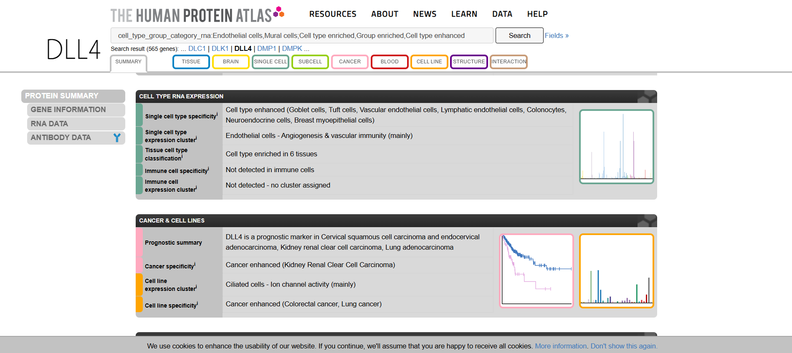
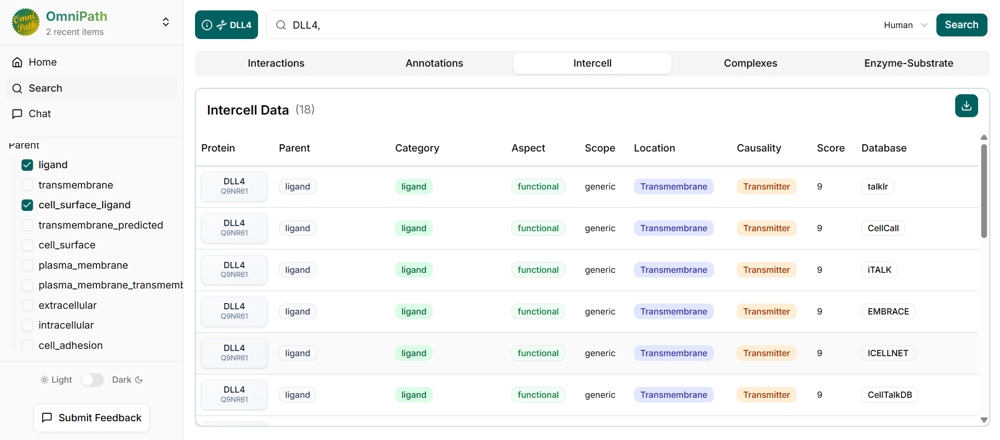
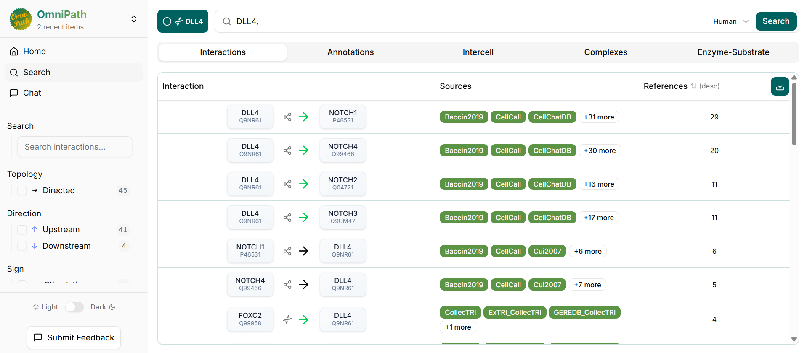
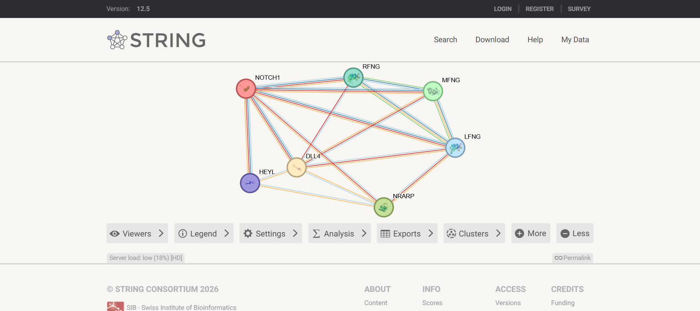
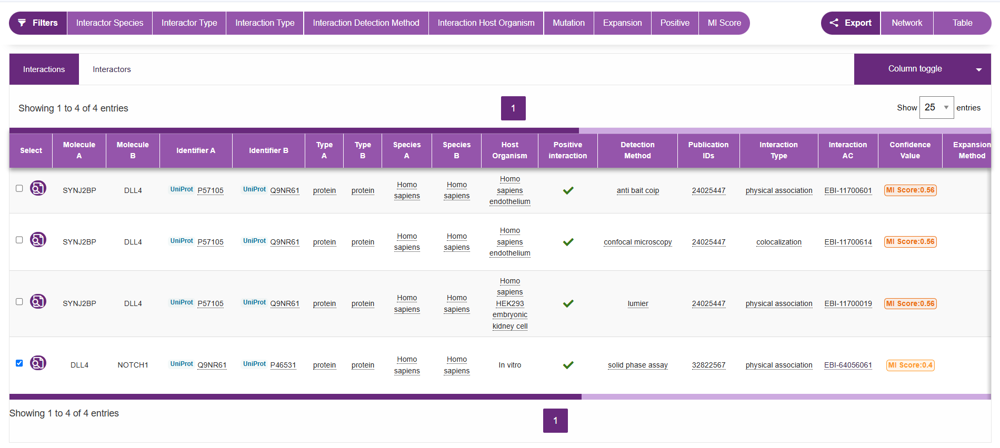
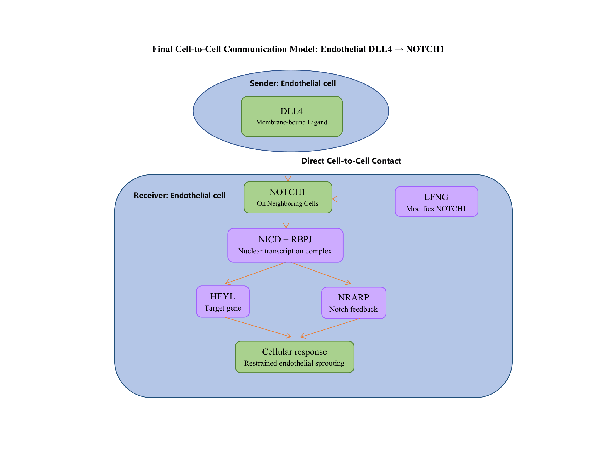

# LABORATORY ACTIVITY Cell-to-Cell Communication
Endothelial DLL4-NOTCH1 Signaling Between Neighboring Cells in Angiogenesis

**Name:** Obiñeta, Inah Marie

**Date completed:** October 07, 2026

**Sender cell:** Endothelial cell

## 1. Title and biological question

Can an endothelial cell signal to a neighboring endothelial cell through DLL4 and NOTCH1 during angiogenesis?

## 2. Chosen sender cell and biological context

- **Sender cell:** Endothelial cell, the single layer lining blood and lymphatic vessels
- **Context:** Angiogenesis (new blood vessel formation during growth and tissue repair)
- **Why it is a meaningful sender:** it is in direct contact with neighboring cells and signals to them during vessel growth

## 3. Candidate ligand and evidence for sender-cell expression

- **Ligand:** DLL4 (Delta-like canonical Notch ligand 4), UniProt Q9NR61
- **Evidence (Human Protein Atlas):** cell type enhanced in vascular and lymphatic endothelial cells; expression cluster "Endothelial cells - Angiogenesis & vascular immunity"; not detected in immune cells; predicted location: membrane
- **Signaling type:** contact-dependent. DLL4 is predicted to be a membrane protein and UniProt describes it as a Notch ligand.
- **Limits:** the evidence is RNA-based (HPA proteomics did not detect DLL4), and "enhanced" does not mean exclusive to endothelial cells.

## 4. Receptor and receiver cell with supporting evidence

- **Receptor:** NOTCH1 (Notch receptor 1), UniProt P46531
- **Receiver cell:** a neighboring endothelial cell
- **Evidence:** HPA lists NOTCH1 as cell type enhanced in vascular and lymphatic endothelial cells. UniProt states that DLL4 activates NOTCH1 and NOTCH4.
- **Limits:** NOTCH1 is also enhanced in neutrophils, so it is not endothelial-exclusive.
- **Checkpoint sentence:** The endothelial cell presents DLL4, which can signal through NOTCH1 on a neighboring endothelial cell in the context of angiogenesis.

## 5. OmniPath findings

- DLL4 is annotated as a ligand and cell_surface_ligand (transmembrane, transmitter): 18 records with both filters, 5 of them cell_surface_ligand
- Directed interactions: DLL4 → NOTCH1 (29 references), NOTCH4 (20), NOTCH2 (11), NOTCH3 (11)
- NOTCH1 has the most references of the Notch receptors, so it was chosen as the receptor
- OmniPath annotations are not specific to one cell type, so cell-type evidence comes from HPA

## 6. STRING network interpretation

- **Query:** NOTCH1 and DLL4, *Homo sapiens*, STRING v12.5
- **Network:** 7 proteins and 16 edges (5 expected by chance), PPI enrichment p = 9.13e-05
- **Proteins:** NOTCH1, DLL4, LFNG, MFNG, RFNG, HEYL, NRARP
- **Enriched pathway:** KEGG hsa04330, Notch signaling pathway (7 of 62 proteins, FDR 1.73e-15)
- **Enriched process:** GO:0008593, Regulation of Notch signaling pathway (6 of 99, FDR 1.70e-09)
- **Proteins connecting receptor activation to the response:** NRARP and HEYL (described by STRING as downstream effectors of Notch signaling) and LFNG (modifies NOTCH1 activity)
- STRING edges show functional association, not direct binding or pathway order.

## 7. IntAct validation

| Item | Record |
|---|---|
| Interacting molecules | DLL4 (UniProt Q9NR61) and NOTCH1 (UniProt P46531), both proteins |
| Detection method | Solid phase assay |
| Organism | *Homo sapiens* (both interactors) |
| Host organism | In vitro |
| Publication | PMID 32822567 |
| Interaction type | Physical association |
| Interaction AC | EBI-64056061 |
| Confidence (MI score) | 0.4 |
| Evidence type | Physical association between DLL4 and NOTCH1 from one in vitro experiment. It does not show that the interaction happens in endothelial cells. |
| Additional pairs | Not needed; a useful record was found for the first pair |

## 8. Final model and interpretation

The Human Protein Atlas (HPA) reports DLL4 (Delta-like canonical Notch ligand 4) as enhanced in endothelial cells and predicts it to be membrane-bound, supporting contact-dependent signaling. OmniPath lists DLL4 as a cell-surface ligand and shows DLL4 → NOTCH1 (Notch receptor 1) as its best-supported interaction (29 references). HPA shows NOTCH1 is also enhanced in endothelial cells, so a neighboring endothelial cell is a reasonable receiver. STRING linked both with LFNG (lunatic fringe), HEYL (Hairy/enhancer-of-split related with YRPW motif-like protein), and NRARP (Notch-regulated ankyrin repeat-containing protein), and Notch signaling was enriched (KEGG hsa04330, FDR 1.73e-15; FDR is the false discovery rate). IntAct reports one in vitro assay (PMID 32822567, the PubMed ID; MI score 0.4, the interaction confidence score) supporting a physical association.

Strongly supported: the DLL4-NOTCH1 pair. Inferred: signaling between neighboring endothelial cells, HEYL and NRARP acting downstream, restrained sprouting, and the NICD (Notch intracellular domain) and RBPJ step, which comes from the NOTCH1 annotation, not the network.

## 9. References and database links

- Unique sender (HPA endothelial and mural cells): https://www.proteinatlas.org/humanproteome/single+cell/single+cell+type/endothelial+and+mural+cells
- Signal/ligand (HPA, DLL4): https://www.proteinatlas.org/ENSG00000128917-DLL4
- Receptor and receiver cell (HPA, NOTCH1): https://www.proteinatlas.org/ENSG00000148400-NOTCH1
- OmniPath, DLL4 interactions: https://explore.omnipathdb.org/search?q=DLL4%2C&tab=interactions&species=9606
- STRING network: https://string-db.org/cgi/network?taskId=bkRJgABBsZYi&sessionId=bZA631fiDdNf
- Cellular response (HPA, DLL4 protein function): https://www.proteinatlas.org/ENSG00000128917-DLL4
- IntAct search: https://www.ebi.ac.uk/intact/search?query=EBI-11700027
- IntAct publication: https://pubmed.ncbi.nlm.nih.gov/32822567/
- Repository: https://github.com/iinahmariee/OBINETA-cell-cell-communication
